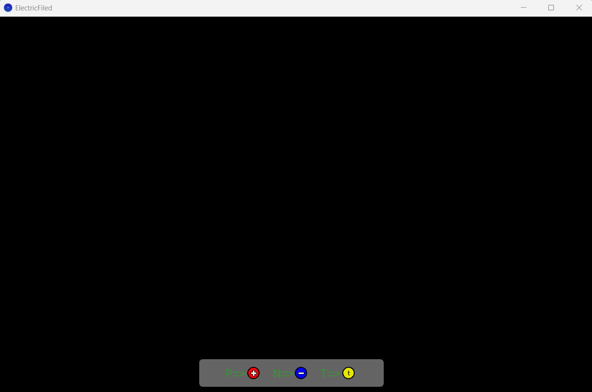

# Electric-Field-Simulator
This simulator will show the electric field lines of a given electro-static system of charges.

To see an electric field lines, the user have to set some charges in space. There are 3 kinds:
1. Positive charge - presented as a red circle with a plus sign on it. To add it, the user needs to press P or p on keyboard.
2. Negative charge - presented as a blue circle with a minus sign on it. To add it, the user needs to press N or n on keyboard.
3. Test charge - presented as a yellow circle with a t letter on it. It is actually a positive charge, but doesn't affect the electric field. By putting it in space, the user can see the electric force vector applied on it (includes direction and power). To add it, the user needs to press T or t on keyboard.

Start screen (empty system):

## How to use?
Whether the user will put positive, negative or test charge - the charge initial position will always be in the center of the screen.
To change the charge location the user have to grab the specific charge, move it to new location, and press enter to release the charge there.
You can also remove any charge by click on it, and press backspace button.

Electric field example:

Enjoy discovering the electro-static systems electric fields!

## Running the simulator
In order to run this app:
* Install Processing software.
* Open src folder and click on run button.